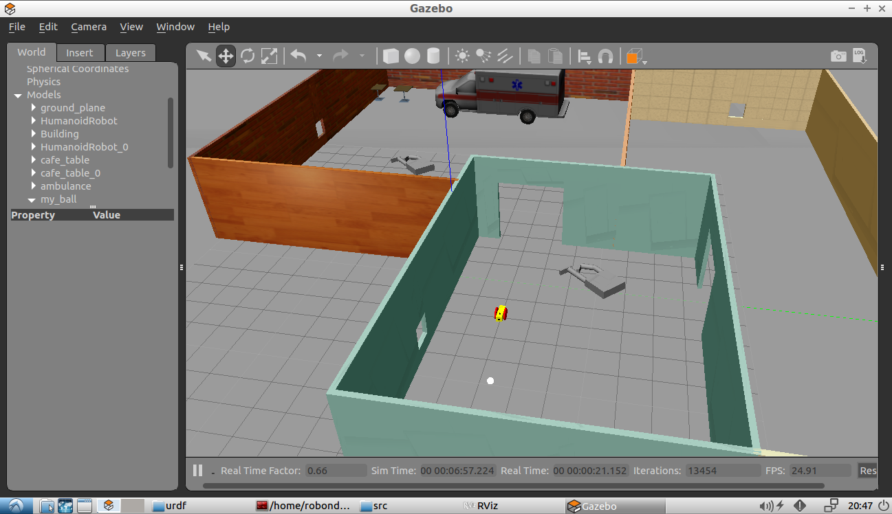

# Go Chase It

This is the second project of Udacity's Robotics Software Engineer Nanodegree. I designed a mobile robot with camera and LIDAR.
I placed it on the world from [previous project](https://github.com/korhanmd/udacity-build-my-world). If the robot sees a white ball, chases it.

There are two packages in the project. They are `my_robot` and `ball_chaser`. The submodules of this repo are these packages. `my_robot` package has robot and world definitions.
`ball_chaser` package has scripts for robot behaviour. It includes `drive_bot` and `process_image` nodes. `drive_bot` node has service to publish velocities to the robot.
`process_image` node processes the image captured by camera. Checks for white ball. If it finds a white ball, requests service to move robot through the ball.

Here is the example screenshot of my world:

## Requirements

These are the rubric items to be met in the project.

##### Robot Design Requirements:

- Lidar and camera sensors.
- Gazebo plugins for the robot’s differential drive, lidar, and camera.
- Housed inside the world
- Significant changes from the sample taught in the project lesson.
- Robot is stable when moving

##### Gazebo World Requirements:

- Same as the world designed in the Build My World project or a new world that you design on the building editor for this project.
- Includes a white-colored ball

##### `drive_bot` Requirements:

- A ball_chaser/command_robot service.
- Service accepts linear x and angular z velocities.
- Service publishes to the the wheel joints.
- Service returns the requested velocities.

##### `process_image` Requirements:

- Subscribes to the robot’s camera image.
- A function to analyze the image and determine the presence and position of a white ball.
- Requests a service to drive the robot towards a white ball (when present).

##### `world.launch` Requirements:

- Launch the world (which includes a white ball).
- Launch the robot.

##### `ball_chaser.launch` Requirements:

- Run the drive_bot C++ node.
- Run the process_image C++ node.
